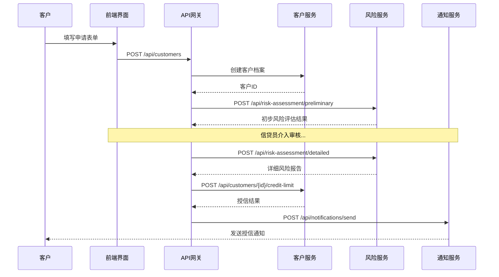

# Legacy JSP系统API提取方法论

## 📋 **文档概述**

**文档名称**: JSP单体应用到REST API的提取方法论  
**适用场景**: Legacy JSP+Java单体应用向微服务架构迁移  
**目标读者**: 架构师、开发团队、项目经理  
**编写日期**: 2025-01-15  

---

## 🎯 **方法论概述**

### **核心挑战**
将紧耦合的JSP+Java单体应用解耦为独立的前后端架构，关键在于：
1. **功能边界识别** - 从混合代码中分离业务逻辑
2. **数据模型重构** - 将页面级数据转换为API模型
3. **状态管理分离** - 从服务端Session转为前端状态管理
4. **业务流程解耦** - 将页面跳转转换为API调用链

### **提取策略矩阵**

| 方法 | 适用场景 | 复杂度 | 推荐度 | 完成时间 |
|------|----------|--------|--------|----------|
| **页面功能分析法** | 用户界面清晰的系统 | ⭐⭐ | ⭐⭐⭐⭐⭐ | 2-3天 |
| **数据流分析法** | 数据密集型系统 | ⭐⭐⭐ | ⭐⭐⭐⭐ | 3-5天 |
| **业务域驱动法** | 复杂业务逻辑系统 | ⭐⭐⭐⭐ | ⭐⭐⭐ | 5-7天 |
| **用户旅程映射法** | 工作流驱动系统 | ⭐⭐⭐ | ⭐⭐⭐ | 3-4天 |

---

## 🔍 **方法一：页面功能分析法**

### **理论基础**
基于用户界面功能点逆向推导API需求，适合UI层次清晰的系统。

### **核心原理**
```
JSP页面 → 用户操作 → 数据交互 → API端点
```

### **实施步骤**

#### **步骤1: 页面清单梳理**
```bash
# 执行命令：扫描所有JSP文件
find . -name "*.jsp" | sort > jsp_inventory.txt

# 分析结果示例（基于我们的Credit Control System）
customer-search-working.jsp    # 客户搜索功能
customer-details.jsp          # 客户详情展示
credit-limit-modify.jsp       # 信用额度修改
risk-assessment.jsp           # 风险评估仪表板
reports-dashboard.jsp         # 报表分析面板
collections-management.jsp    # 催收管理
payment-tracking.jsp          # 付款跟踪
...（其他业务页面）
```

#### **步骤2: 功能点提取**
为每个JSP页面创建功能分析表：

**模板：功能分析表**
```markdown
## 页面：customer-search-working.jsp

### 页面职责
客户信息搜索和列表展示

### 用户操作分析
| 操作 | 触发事件 | 数据流向 | API需求 |
|------|----------|----------|---------|
| 搜索客户 | 点击搜索按钮 | 前端→后端查询 | GET /api/customers?search={term} |
| 查看详情 | 点击客户名称 | 跳转详情页 | GET /api/customers/{id} |
| 分页浏览 | 点击页码 | 分页数据加载 | GET /api/customers?page={n}&size={s} |
| 高级筛选 | 设置筛选条件 | 条件过滤查询 | GET /api/customers?filter={conditions} |

### 数据模型需求
- CustomerSearchRequest: 搜索请求参数
- CustomerListResponse: 分页列表响应
- CustomerSummary: 列表项摘要信息
```

#### **步骤3: API端点设计**
基于功能分析，设计REST API：

```typescript
// 客户搜索API设计
interface CustomerAPI {
  // 搜索客户列表
  searchCustomers(request: {
    search?: string;        // 搜索关键词
    page?: number;          // 页码
    size?: number;          // 每页大小
    sortBy?: string;        // 排序字段
    sortDir?: 'asc' | 'desc'; // 排序方向
    filters?: CustomerFilter; // 过滤条件
  }): Promise<{
    customers: CustomerSummary[];
    total: number;
    page: number;
    size: number;
  }>;

  // 获取客户详情
  getCustomer(id: string): Promise<CustomerDetail>;
}

// 数据模型定义
interface CustomerSummary {
  id: string;
  name: string;
  creditLimit: number;
  riskLevel: 'LOW' | 'MEDIUM' | 'HIGH';
  lastActivity: string;
  status: 'ACTIVE' | 'INACTIVE' | 'SUSPENDED';
}

interface CustomerDetail extends CustomerSummary {
  contactInfo: ContactInfo;
  creditHistory: CreditTransaction[];
  riskFactors: RiskFactor[];
  recentTransactions: Transaction[];
}
```

#### **步骤4: 实操工具和模板**

**工具1: JSP页面分析脚本**
```bash
#!/bin/bash
# scripts/analyze_jsp_pages.sh

echo "=== JSP页面功能分析报告 ==="
echo "生成时间: $(date)"
echo ""

for jsp_file in $(find . -name "*.jsp"); do
    echo "## 分析文件: $jsp_file"
    
    # 提取表单元素
    echo "### 表单分析:"
    grep -n "<form\|<input\|<select\|<textarea" "$jsp_file" | head -10
    
    # 提取JavaScript函数
    echo "### JavaScript函数:"
    grep -n "function\|onclick\|onsubmit" "$jsp_file" | head -5
    
    # 提取数据绑定
    echo "### 数据绑定:"
    grep -n "<%=\|${" "$jsp_file" | head -5
    
    echo "---"
done
```

**模板2: API设计文档生成器**
```python
# scripts/generate_api_docs.py
import re
import json
from pathlib import Path

class JSPApiExtractor:
    def __init__(self, jsp_dir):
        self.jsp_dir = Path(jsp_dir)
        self.apis = {}
    
    def extract_forms(self, jsp_content):
        """提取表单字段，生成API参数"""
        forms = re.findall(r'<form[^>]*>(.*?)</form>', jsp_content, re.DOTALL)
        api_params = []
        
        for form in forms:
            inputs = re.findall(r'<input[^>]*name="([^"]*)"[^>]*>', form)
            selects = re.findall(r'<select[^>]*name="([^"]*)"[^>]*>', form)
            api_params.extend(inputs + selects)
        
        return api_params
    
    def analyze_jsp_file(self, jsp_file):
        """分析单个JSP文件"""
        content = jsp_file.read_text(encoding='utf-8', errors='ignore')
        
        return {
            'file': str(jsp_file),
            'forms': self.extract_forms(content),
            'suggested_apis': self.suggest_apis(jsp_file.stem)
        }
    
    def suggest_apis(self, page_name):
        """基于页面名称推荐API端点"""
        api_suggestions = {
            'customer-search': [
                'GET /api/customers',
                'GET /api/customers/{id}'
            ],
            'credit-limit': [
                'GET /api/customers/{id}/credit',
                'PUT /api/customers/{id}/credit'
            ],
            'reports': [
                'GET /api/reports',
                'POST /api/reports/generate'
            ]
        }
        
        for key, apis in api_suggestions.items():
            if key in page_name:
                return apis
        
        return [f'GET /api/{page_name}', f'POST /api/{page_name}']
    
    def generate_report(self):
        """生成完整分析报告"""
        jsp_files = list(self.jsp_dir.glob('**/*.jsp'))
        
        for jsp_file in jsp_files:
            analysis = self.analyze_jsp_file(jsp_file)
            self.apis[jsp_file.stem] = analysis
        
        return self.apis

# 使用示例
if __name__ == "__main__":
    extractor = JSPApiExtractor('./src/main/webapp')
    report = extractor.generate_report()
    
    # 生成JSON报告
    with open('api_extraction_report.json', 'w') as f:
        json.dump(report, f, indent=2, ensure_ascii=False)
    
    print("API提取报告已生成: api_extraction_report.json")
```

---

## 📊 **方法二：数据流分析法**

### **理论基础**
从数据库模式和数据访问模式出发，构建以数据为中心的API设计。

### **核心原理**
```
数据库表 → 实体模型 → CRUD操作 → REST端点
```

### **实施步骤**

#### **步骤1: 数据模型分析**
```sql
-- 分析现有数据表结构
-- 基于我们的Credit Control System的8个核心表

-- 1. 客户基础信息表
CREATE TABLE customers (
    id SERIAL PRIMARY KEY,
    name VARCHAR(255) NOT NULL,
    email VARCHAR(255),
    phone VARCHAR(50),
    address TEXT,
    created_at TIMESTAMP DEFAULT CURRENT_TIMESTAMP,
    updated_at TIMESTAMP DEFAULT CURRENT_TIMESTAMP
);

-- 2. 客户信用信息表
CREATE TABLE customer_credit (
    id SERIAL PRIMARY KEY,
    customer_id INTEGER REFERENCES customers(id),
    credit_limit DECIMAL(15,2),
    available_credit DECIMAL(15,2),
    risk_level VARCHAR(20) DEFAULT 'MEDIUM',
    last_assessment_date DATE,
    created_at TIMESTAMP DEFAULT CURRENT_TIMESTAMP
);

-- 分析表关系，设计API层次结构
```

#### **步骤2: 实体关系映射**
```typescript
// 数据实体到API模型的映射

// 数据库实体
interface CustomerEntity {
  id: number;
  name: string;
  email?: string;
  phone?: string;
  address?: string;
  created_at: Date;
  updated_at: Date;
}

interface CreditEntity {
  id: number;
  customer_id: number;
  credit_limit: number;
  available_credit: number;
  risk_level: string;
  last_assessment_date: Date;
  created_at: Date;
}

// API数据传输对象(DTO)
interface CustomerDto {
  id: string;                    // 转换为string类型
  name: string;
  contactInfo: {                 // 组合相关字段
    email?: string;
    phone?: string;
    address?: string;
  };
  metadata: {                    // 元数据分组
    createdAt: string;          // ISO日期格式
    updatedAt: string;
  };
}

interface CreditDto {
  customerId: string;
  limits: {
    total: number;
    available: number;
    used: number;              // 计算字段
  };
  riskAssessment: {
    level: 'LOW' | 'MEDIUM' | 'HIGH';
    lastAssessmentDate: string;
  };
}
```

#### **步骤3: CRUD操作映射**
```typescript
// 自动生成基础CRUD API

class EntityApiGenerator {
  generateCrudApi(entity: string, fields: string[]): ApiEndpoints {
    return {
      // Create
      [`POST /api/${entity.toLowerCase()}s`]: {
        description: `Create new ${entity}`,
        requestBody: this.generateCreateRequest(fields),
        response: this.generateEntityResponse(fields)
      },
      
      // Read (List)
      [`GET /api/${entity.toLowerCase()}s`]: {
        description: `List ${entity}s with pagination and filtering`,
        queryParams: {
          page: 'number',
          size: 'number',
          sortBy: fields.join(' | '),
          sortDir: 'asc | desc',
          ...this.generateFilterParams(fields)
        },
        response: this.generateListResponse(fields)
      },
      
      // Read (Single)
      [`GET /api/${entity.toLowerCase()}s/{id}`]: {
        description: `Get ${entity} by ID`,
        pathParams: { id: 'string' },
        response: this.generateEntityResponse(fields)
      },
      
      // Update
      [`PUT /api/${entity.toLowerCase()}s/{id}`]: {
        description: `Update ${entity}`,
        pathParams: { id: 'string' },
        requestBody: this.generateUpdateRequest(fields),
        response: this.generateEntityResponse(fields)
      },
      
      // Delete
      [`DELETE /api/${entity.toLowerCase()}s/{id}`]: {
        description: `Delete ${entity}`,
        pathParams: { id: 'string' },
        response: { message: 'string' }
      }
    };
  }
}

// 使用示例：为Customer实体生成API
const generator = new EntityApiGenerator();
const customerApi = generator.generateCrudApi('Customer', [
  'name', 'email', 'phone', 'address'
]);
```

#### **步骤4: 关联关系处理**
```typescript
// 处理复杂的实体关系

interface RelationshipApiPatterns {
  // 一对一关系：Customer -> CreditProfile
  'GET /api/customers/{id}/credit': CreditDto;
  'PUT /api/customers/{id}/credit': CreditDto;
  
  // 一对多关系：Customer -> Transactions
  'GET /api/customers/{id}/transactions': {
    transactions: TransactionDto[];
    pagination: PaginationInfo;
  };
  
  // 多对多关系：Customer -> Categories (through assignments)
  'GET /api/customers/{id}/categories': CategoryDto[];
  'POST /api/customers/{id}/categories': { categoryId: string };
  'DELETE /api/customers/{id}/categories/{categoryId}': void;
}
```

---

## 🏗️ **方法三：业务域驱动法 (DDD)**

### **理论基础**
使用领域驱动设计思想，基于业务域和聚合根设计API边界。

### **核心原理**
```
业务域识别 → 聚合根定义 → 领域服务 → API端点设计
```

### **实施步骤**

#### **步骤1: 业务域识别**
```markdown
## Credit Control System业务域分析

### 核心业务域
1. **客户管理域 (Customer Management)**
   - 聚合根: Customer
   - 职责: 客户信息管理、客户分类、联系方式维护

2. **信用管理域 (Credit Management)**  
   - 聚合根: CreditAccount
   - 职责: 信用额度管理、风险评估、信用历史跟踪

3. **交易处理域 (Transaction Processing)**
   - 聚合根: Transaction
   - 职责: 交易记录、付款处理、对账管理

4. **风险控制域 (Risk Management)**
   - 聚合根: RiskProfile
   - 职责: 风险评估、预警系统、风险模型管理

5. **报表分析域 (Reporting & Analytics)**
   - 聚合根: Report
   - 职责: 数据聚合、报表生成、业务分析
```

#### **步骤2: 聚合根设计**
```typescript
// 客户管理域聚合根
class Customer {
  private constructor(
    private readonly id: CustomerId,
    private personalInfo: PersonalInfo,
    private contactInfo: ContactInfo,
    private status: CustomerStatus
  ) {}
  
  // 领域方法
  public updateContactInfo(newContactInfo: ContactInfo): DomainEvent[] {
    const events: DomainEvent[] = [];
    
    if (!this.contactInfo.equals(newContactInfo)) {
      this.contactInfo = newContactInfo;
      events.push(new CustomerContactUpdated(this.id, newContactInfo));
    }
    
    return events;
  }
  
  public changeStatus(newStatus: CustomerStatus, reason: string): DomainEvent[] {
    const events: DomainEvent[] = [];
    
    if (this.canChangeStatusTo(newStatus)) {
      const oldStatus = this.status;
      this.status = newStatus;
      events.push(new CustomerStatusChanged(this.id, oldStatus, newStatus, reason));
    }
    
    return events;
  }
  
  // 业务规则验证
  private canChangeStatusTo(newStatus: CustomerStatus): boolean {
    // 实现业务规则
    return this.status.canTransitionTo(newStatus);
  }
}

// 对应的API设计
interface CustomerDomainApi {
  // 基于聚合根的操作
  'POST /api/customers': {
    request: CreateCustomerCommand;
    response: CustomerDto;
  };
  
  'PUT /api/customers/{id}/contact-info': {
    request: UpdateContactInfoCommand;
    response: CustomerDto;
  };
  
  'POST /api/customers/{id}/status-change': {
    request: ChangeCustomerStatusCommand;
    response: CustomerDto;
  };
}
```

#### **步骤3: 领域服务设计**
```typescript
// 跨聚合根的业务逻辑
class CreditAssessmentService {
  constructor(
    private customerRepo: CustomerRepository,
    private creditRepo: CreditRepository,
    private transactionRepo: TransactionRepository,
    private riskEngine: RiskEngine
  ) {}
  
  async assessCreditRisk(customerId: CustomerId): Promise<RiskAssessmentResult> {
    // 获取相关聚合根
    const customer = await this.customerRepo.findById(customerId);
    const creditHistory = await this.creditRepo.findByCustomerId(customerId);
    const recentTransactions = await this.transactionRepo.findRecentByCustomerId(customerId);
    
    // 执行风险评估
    return this.riskEngine.assess({
      customer,
      creditHistory,
      recentTransactions
    });
  }
}

// 对应的API设计
interface CreditAssessmentApi {
  'POST /api/credit-assessment/{customerId}': {
    request: AssessCreditRiskCommand;
    response: RiskAssessmentResult;
  };
}
```

---

## 🗺️ **方法四：用户旅程映射法**

### **理论基础**
从用户完整业务流程出发，识别关键接触点和数据交互需求。

### **核心原理**
```
用户旅程 → 关键接触点 → 数据交互 → API序列
```

### **实施步骤**

#### **步骤1: 用户旅程识别**
```markdown
## 信用评估业务流程

### 旅程：新客户信用额度申请
**参与角色**: 客户、信贷员、风控专员

**流程步骤**:
1. 客户提交基本信息 → `POST /api/customers`
2. 系统自动进行初步风险评估 → `POST /api/risk-assessment/preliminary`  
3. 信贷员审核客户资料 → `GET /api/customers/{id}`, `PUT /api/customers/{id}/review-status`
4. 风控专员进行详细风险分析 → `POST /api/risk-assessment/detailed`
5. 系统计算推荐信用额度 → `POST /api/credit-limit/calculate`
6. 信贷员确认并分配额度 → `POST /api/customers/{id}/credit-limit`
7. 客户接收授信通知 → `POST /api/notifications/send`

### API序列图

```

#### **步骤2: 接触点分析**
```typescript
// 用户旅程中的关键接触点和对应API

interface CustomerOnboardingJourney {
  // 接触点1: 信息收集
  collectBasicInfo: {
    api: 'POST /api/customers/draft';
    payload: CustomerBasicInfo;
    response: { draftId: string; validationErrors: ValidationError[] };
  };
  
  // 接触点2: 文档上传
  uploadDocuments: {
    api: 'POST /api/customers/{id}/documents';
    payload: FormData; // 包含文件
    response: { documentIds: string[]; processingStatus: string };
  };
  
  // 接触点3: 自动验证
  triggerVerification: {
    api: 'POST /api/customers/{id}/verify';
    payload: { verificationType: 'identity' | 'income' | 'address' };
    response: { verificationId: string; estimatedTime: number };
  };
  
  // 接触点4: 人工审核
  submitForReview: {
    api: 'POST /api/customers/{id}/review-queue';
    payload: { priority: 'normal' | 'high'; assignedReviewer?: string };
    response: { queuePosition: number; estimatedWaitTime: number };
  };
  
  // 接触点5: 决策通知
  getFinalDecision: {
    api: 'GET /api/customers/{id}/application-status';
    response: {
      status: 'approved' | 'rejected' | 'pending';
      creditLimit?: number;
      conditions?: string[];
      nextSteps: string[];
    };
  };
}
```

---

## 🛠️ **通用实操工具**

### **工具1: API设计验证清单**
```markdown
## API设计质量检查清单

### ✅ RESTful设计原则
- [ ] 使用标准HTTP方法 (GET, POST, PUT, DELETE)
- [ ] 资源命名采用复数形式 (/api/customers, /api/orders)
- [ ] 状态码使用正确 (200, 201, 400, 404, 500)
- [ ] 支持内容协商 (Accept: application/json)

### ✅ 数据一致性
- [ ] 输入验证完整
- [ ] 输出格式统一
- [ ] 错误处理标准化
- [ ] 分页参数一致

### ✅ 安全考虑
- [ ] 认证机制设计
- [ ] 授权控制实现
- [ ] 敏感数据保护
- [ ] 输入安全过滤

### ✅ 性能优化  
- [ ] 支持字段选择 (?fields=name,email)
- [ ] 实现数据缓存策略
- [ ] 大数据集分页处理
- [ ] 批量操作支持
```

### **工具2: API文档生成工具**
```python
# scripts/api_doc_generator.py

class OpenApiGenerator:
    def __init__(self):
        self.spec = {
            "openapi": "3.0.0",
            "info": {
                "title": "Credit Control System API",
                "version": "1.0.0",
                "description": "从Legacy JSP系统提取的REST API"
            },
            "paths": {}
        }
    
    def add_crud_endpoints(self, entity_name, fields):
        """为实体添加标准CRUD端点"""
        base_path = f"/api/{entity_name.lower()}s"
        
        # GET /api/entities (List)
        self.spec["paths"][base_path] = {
            "get": {
                "summary": f"List {entity_name}s",
                "parameters": [
                    {
                        "name": "page",
                        "in": "query", 
                        "schema": {"type": "integer", "default": 1}
                    },
                    {
                        "name": "size",
                        "in": "query",
                        "schema": {"type": "integer", "default": 20}
                    }
                ],
                "responses": {
                    "200": {
                        "description": "Successful response",
                        "content": {
                            "application/json": {
                                "schema": self.generate_list_schema(entity_name, fields)
                            }
                        }
                    }
                }
            },
            # POST /api/entities (Create)  
            "post": {
                "summary": f"Create {entity_name}",
                "requestBody": {
                    "content": {
                        "application/json": {
                            "schema": self.generate_entity_schema(entity_name, fields)
                        }
                    }
                },
                "responses": {
                    "201": {
                        "description": "Created successfully",
                        "content": {
                            "application/json": {
                                "schema": self.generate_entity_schema(entity_name, fields, include_id=True)
                            }
                        }
                    }
                }
            }
        }
        
        # GET /api/entities/{id} (Get by ID)
        self.spec["paths"][f"{base_path}/{{id}}"] = {
            "get": {
                "summary": f"Get {entity_name} by ID",
                "parameters": [
                    {
                        "name": "id",
                        "in": "path",
                        "required": True,
                        "schema": {"type": "string"}
                    }
                ],
                "responses": {
                    "200": {
                        "description": "Successful response",
                        "content": {
                            "application/json": {
                                "schema": self.generate_entity_schema(entity_name, fields, include_id=True)
                            }
                        }
                    },
                    "404": {
                        "description": "Entity not found"
                    }
                }
            }
        }
    
    def generate_entity_schema(self, entity_name, fields, include_id=False):
        """生成实体Schema"""
        properties = {}
        
        if include_id:
            properties["id"] = {"type": "string"}
        
        for field in fields:
            properties[field] = self.infer_field_type(field)
        
        return {
            "type": "object",
            "properties": properties,
            "required": [f for f in fields if self.is_required_field(f)]
        }
    
    def infer_field_type(self, field_name):
        """根据字段名推断类型"""
        type_mapping = {
            'id': {'type': 'string'},
            'email': {'type': 'string', 'format': 'email'},
            'phone': {'type': 'string'},
            'name': {'type': 'string'},
            'amount': {'type': 'number'},
            'date': {'type': 'string', 'format': 'date'},
            'created_at': {'type': 'string', 'format': 'date-time'},
            'updated_at': {'type': 'string', 'format': 'date-time'}
        }
        
        for key, type_def in type_mapping.items():
            if key in field_name.lower():
                return type_def
        
        return {'type': 'string'}  # 默认类型
    
    def export_spec(self, filename="api_spec.json"):
        """导出OpenAPI规范"""
        import json
        with open(filename, 'w') as f:
            json.dump(self.spec, f, indent=2)

# 使用示例
generator = OpenApiGenerator()
generator.add_crud_endpoints("Customer", ["name", "email", "phone", "address"])
generator.add_crud_endpoints("CreditAccount", ["customer_id", "credit_limit", "risk_level"])
generator.export_spec("credit_control_api.json")
```

### **工具3: API测试生成器**  
```python
# scripts/api_test_generator.py

class ApiTestGenerator:
    def __init__(self, base_url="http://localhost:8080"):
        self.base_url = base_url
        
    def generate_postman_collection(self, api_spec):
        """生成Postman测试集合"""
        collection = {
            "info": {
                "name": "Credit Control System API Tests",
                "description": "从Legacy JSP提取的API测试用例"
            },
            "item": []
        }
        
        for path, methods in api_spec.get("paths", {}).items():
            for method, spec in methods.items():
                test_case = {
                    "name": f"{method.upper()} {path}",
                    "request": {
                        "method": method.upper(),
                        "header": [
                            {
                                "key": "Content-Type",
                                "value": "application/json"
                            }
                        ],
                        "url": {
                            "raw": f"{self.base_url}{path}",
                            "host": [self.base_url.split("://")[1].split(":")[0]],
                            "port": self.base_url.split(":")[-1] if ":" in self.base_url.split("://")[1] else "",
                            "path": path.split("/")[1:]
                        }
                    },
                    "response": []
                }
                
                # 添加测试断言
                if method.lower() == "get":
                    test_case["event"] = [{
                        "listen": "test",
                        "script": {
                            "exec": [
                                "pm.test('Status code is 200', function () {",
                                "    pm.response.to.have.status(200);",
                                "});",
                                "",
                                "pm.test('Response has required fields', function () {",
                                "    const jsonData = pm.response.json();",
                                "    pm.expect(jsonData).to.have.property('id');",
                                "});"
                            ]
                        }
                    }]
                
                collection["item"].append(test_case)
        
        return collection
    
    def generate_junit_tests(self, entity_name, api_endpoints):
        """生成JUnit集成测试"""
        test_class = f"""
package com.creditcontrol.api.integration;

import org.junit.jupiter.api.Test;
import org.springframework.boot.test.context.SpringBootTest;
import org.springframework.test.context.TestPropertySource;
import org.springframework.test.web.servlet.MockMvc;
import static org.springframework.test.web.servlet.request.MockMvcRequestBuilders.*;
import static org.springframework.test.web.servlet.result.MockMvcResultMatchers.*;
import static org.hamcrest.Matchers.*;

@SpringBootTest
@TestPropertySource(locations = "classpath:application-test.properties")
class {entity_name}ApiIntegrationTest {{

    @Autowired
    private MockMvc mockMvc;
    
    @Test
    void testGet{entity_name}s() throws Exception {{
        mockMvc.perform(get("/api/{entity_name.lower()}s"))
                .andExpect(status().isOk())
                .andExpect(jsonPath("$.data", hasSize(greaterThanOrEqualTo(0))))
                .andExpect(jsonPath("$.pagination.page", is(1)))
                .andExpect(jsonPath("$.pagination.size", is(20)));
    }}
    
    @Test  
    void testGet{entity_name}ById() throws Exception {{
        // 首先创建一个测试实体
        String testId = createTest{entity_name}();
        
        mockMvc.perform(get("/api/{entity_name.lower()}s/" + testId))
                .andExpect(status().isOk())
                .andExpected(jsonPath("$.id", is(testId)));
    }}
    
    @Test
    void testCreate{entity_name}() throws Exception {{
        String requestBody = """
            {{
                "name": "Test Customer",
                "email": "test@example.com"
            }}
            """;
            
        mockMvc.perform(post("/api/{entity_name.lower()}s")
                .contentType(MediaType.APPLICATION_JSON)
                .content(requestBody))
                .andExpect(status().isCreated())
                .andExpect(jsonPath("$.name", is("Test Customer")))
                .andExpected(jsonPath("$.id", notNullValue()));
    }}
    
    private String createTest{entity_name}() throws Exception {{
        // 实现测试数据创建逻辑
        return "test-id-123";
    }}
}}
"""
        return test_class
```

---

## 📈 **最佳实践总结**

### **选择策略建议**

#### **简单系统 (< 10个页面)**
推荐：**页面功能分析法**
- 时间成本低，容易理解
- API设计直观，贴近用户需求
- 适合快速POC验证

#### **中等复杂系统 (10-30个页面)**  
推荐：**页面功能分析法 + 数据流分析法**
- 先用页面分析识别主要功能
- 再用数据流分析补充CRUD API
- 确保数据一致性

#### **复杂业务系统 (30+页面)**
推荐：**业务域驱动法 + 用户旅程映射法**
- DDD确保API边界清晰
- 用户旅程保证业务流程完整
- 适合长期维护的系统

### **质量保证检查点**

```markdown
## API提取质量门禁

### 🔍 完整性检查 
- [ ] 覆盖所有JSP页面功能点
- [ ] 包含所有数据表的CRUD操作  
- [ ] 支持完整的用户业务流程

### 🎯 一致性检查
- [ ] 命名规范统一 
- [ ] 数据格式标准化
- [ ] 错误处理一致

### ⚡ 性能考虑
- [ ] 分页策略设计
- [ ] 批量操作支持
- [ ] 缓存策略规划

### 🔒 安全设计
- [ ] 认证授权方案
- [ ] 数据验证机制
- [ ] 敏感信息保护
```

### **迭代优化策略**

1. **MVP阶段**: 先实现核心CRUD API
2. **功能完善**: 补充业务逻辑API
3. **性能优化**: 添加缓存、批量操作
4. **安全加固**: 完善认证授权
5. **监控完善**: 添加日志、指标

---

## 📚 **相关文档**

- [项目架构设计](./ARCHITECTURE.md)
- [数据迁移计划](./DATA_MIGRATION.md)  
- [实施方法论](./IMPLEMENTATION.md)
- [测试策略文档](./TESTING_STRATEGY.md)

---

**最后更新**: 2025-01-15  
**版本**: 1.0.0  
**维护者**: Claude AI Architecture Team