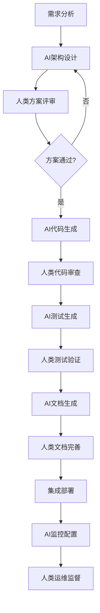

# 架构设计文档

## Legacy vs Azure 架构对比

### 当前Legacy架构

```
┌─────────────────┐    ┌──────────────────┐    ┌─────────────────┐
│   前端层 (JSP)   │    │   业务逻辑层      │    │   数据访问层     │
│                │    │   (Java 8)      │    │   (JDBC)       │
│ • 客户搜索      │────│ • CustomerDAO    │────│ • PostgreSQL   │
│ • 信用管理      │    │ • CreditService  │    │ • 8个核心表     │
│ • 报表分析      │    │ • RiskEngine     │    │ • 连接池        │
│ • 监控面板      │    │ • BusinessRule   │    │                │
└─────────────────┘    └──────────────────┘    └─────────────────┘
```

### 过渡期容器化架构

**阶段1: 容器化现代化 (当前实施中)**

```
┌──────────────────────────────────────────────────────────────────┐
│                    Docker容器化平台                              │
├──────────────────────────────────────────────────────────────────┤
│                        前端层                                     │
│  ┌─────────────────────────────────────────────────────────────┐ │
│  │                React Frontend                              │ │
│  │       (Nginx容器 + React SPA)                              │ │
│  │  • 现代化UI/UX  • 响应式设计  • TypeScript支持              │ │
│  │  端口: 3000                                                 │ │
│  └─────────────────────────────────────────────────────────────┘ │
├──────────────────────────────────────────────────────────────────┤
│                      API网关层                                   │
│  ┌─────────────────────────────────────────────────────────────┐ │
│  │                Nginx反向代理                               │ │
│  │  • 路由管理  • 负载均衡  • SSL终端  • CORS处理             │ │
│  │  端口: 80/443                                              │ │
│  └─────────────────────────────────────────────────────────────┘ │
├──────────────────────────────────────────────────────────────────┤
│                      微服务层                                     │
│  ┌──────────────┐ ┌──────────────┐ ┌──────────────┐            │
│  │Customer      │ │Credit        │ │Risk          │            │
│  │Service       │ │Service       │ │Service       │            │
│  │(Spring Boot) │ │(Spring Boot) │ │(Spring Boot) │            │
│  │端口: 8081     │ │端口: 8082     │ │端口: 8083     │            │
│  └──────────────┘ └──────────────┘ └──────────────┘            │
│  ┌──────────────┐ ┌──────────────┐ ┌──────────────┐            │
│  │Payment       │ │Report        │ │Notification  │            │
│  │Service       │ │Service       │ │Service       │            │
│  │(Spring Boot) │ │(Spring Boot) │ │(Spring Boot) │            │
│  │端口: 8084     │ │端口: 8085     │ │端口: 8086     │            │
│  └──────────────┘ └──────────────┘ └──────────────┘            │
├──────────────────────────────────────────────────────────────────┤
│                      数据层                                       │
│  ┌─────────────────┐ ┌─────────────────┐ ┌─────────────────┐   │
│  │PostgreSQL       │ │Redis Cache      │ │文件存储          │   │
│  │(容器化数据库)    │ │(Session/Cache)  │ │(本地Volume)     │   │
│  │端口: 5432        │ │端口: 6379        │ │                │   │
│  └─────────────────┘ └─────────────────┘ └─────────────────┘   │
├──────────────────────────────────────────────────────────────────┤
│                    监控和日志层                                   │
│  ┌─────────────────┐ ┌─────────────────┐ ┌─────────────────┐   │
│  │Prometheus       │ │ELK Stack        │ │Grafana          │   │
│  │(监控指标)        │ │(日志聚合)        │ │(可视化面板)      │   │
│  └─────────────────┘ └─────────────────┘ └─────────────────┘   │
├──────────────────────────────────────────────────────────────────┤
│                      批处理层                                     │
│  ┌─────────────────────────────────────────────────────────────┐ │
│  │            Cron Jobs + Spring Batch                       │ │
│  │  • 数据ETL  • 定时任务  • 报表生成  • 数据同步              │ │
│  └─────────────────────────────────────────────────────────────┘ │
└──────────────────────────────────────────────────────────────────┘
```

**容器编排配置:**
```yaml
# docker-compose.yml
services:
  frontend:
    build: ./frontend
    ports: ["3000:3000"]
  
  gateway:
    image: nginx:alpine
    ports: ["80:80", "443:443"]
    
  customer-service:
    build: ./backend/customer-service
    ports: ["8081:8080"]
    
  credit-service:
    build: ./backend/credit-service
    ports: ["8082:8080"]
    
  database:
    image: postgres:15
    ports: ["5432:5432"]
    volumes: ["postgres_data:/var/lib/postgresql/data"]
```

---

## 🔌 **标准端口分配方案**

**⚠️ 警告：以下端口配置为项目标准，禁止修改！**

### **容器化阶段端口映射表**
```
┌─────────────────────┬─────────────────┬─────────────────────────────────────┐
│       服务名称        │   外部端口      │            说明                     │
├─────────────────────┼─────────────────┼─────────────────────────────────────┤
│ React Frontend      │     3000        │ 开发环境前端服务                     │
│ Nginx Gateway       │  8080 (80)      │ API网关和反向代理                    │
├─────────────────────┼─────────────────┼─────────────────────────────────────┤
│ Customer Service    │     8081        │ 客户管理微服务                       │
│ Credit Service      │     8082        │ 信用管理微服务                       │
│ Risk Service        │     8083        │ 风险评估微服务                       │
│ Payment Service     │     8084        │ 付款处理微服务                       │
│ Report Service      │     8085        │ 报表生成微服务                       │
│ Notification Service│     8086        │ 通知推送微服务                       │
├─────────────────────┼─────────────────┼─────────────────────────────────────┤
│ PostgreSQL Database │     5432        │ 主数据库                            │
│ Redis Cache         │     6379        │ 缓存和会话存储                       │
└─────────────────────┴─────────────────┴─────────────────────────────────────┘
```

### **生产环境端口映射表**
```
┌─────────────────────┬─────────────────┬─────────────────────────────────────┐
│       服务名称        │   生产端口      │            说明                     │
├─────────────────────┼─────────────────┼─────────────────────────────────────┤
│ HTTPS Frontend      │      443        │ 生产环境HTTPS入口                   │
│ HTTP Redirect       │       80        │ 自动重定向到HTTPS                   │
├─────────────────────┼─────────────────┼─────────────────────────────────────┤
│ 内部微服务通信      │ 8080 (内部)     │ 容器间通信统一端口                   │
│ 数据库连接          │ 5432 (内部)     │ 数据库内部访问端口                   │
│ 缓存连接            │ 6379 (内部)     │ Redis内部访问端口                   │
└─────────────────────┴─────────────────┴─────────────────────────────────────┘
```

### **Azure迁移后端口映射**
```
┌─────────────────────┬─────────────────┬─────────────────────────────────────┐
│       Azure服务      │   访问端口      │            说明                     │
├─────────────────────┼─────────────────┼─────────────────────────────────────┤
│ Static Web Apps     │   443 (HTTPS)   │ 全球CDN加速的前端                   │
│ API Management      │   443 (HTTPS)   │ 统一API网关                         │
├─────────────────────┼─────────────────┼─────────────────────────────────────┤
│ Azure Functions     │      内部       │ Serverless微服务（内部通信）         │
│ Azure SQL Database  │      内部       │ 托管数据库（VNet内部）               │
│ Redis Cache         │      内部       │ 托管缓存服务（VNet内部）             │
└─────────────────────┴─────────────────┴─────────────────────────────────────┘
```

### **端口使用规则**
1. **开发环境**: 使用上述完整端口映射表
2. **容器内部**: 所有微服务统一使用8080端口
3. **数据库访问**: 仅容器内部网络访问，不对外暴露
4. **生产环境**: 仅暴露80/443端口，内部服务通过私有网络通信
5. **Azure环境**: 依赖Azure服务发现，不依赖固定端口

### **网络访问流程**
```
用户请求 → 8080(Nginx) → 内部微服务(8081-8086) → 数据库(5432) → Redis(6379)
```

---

## 🤖 **AI辅助开发框架**

**项目愿景**: 将本项目作为AI驱动开发效率与质量提升的验证项目，探索人机协作在企业级系统迁移中的最佳实践。

### **AI集成策略**

#### **AI角色定义**
```
┌─────────────────────────────────────────────────────────────────┐
│                    AI辅助开发生态系统                            │
├─────────────────────────────────────────────────────────────────┤
│                      AI协作层                                   │
│  ┌─────────────────┐ ┌─────────────────┐ ┌─────────────────┐  │
│  │ 架构AI          │ │ 开发AI          │ │ 质量AI          │  │
│  │ (Claude)        │ │ (Copilot/Cursor)│ │ (自动化测试)     │  │
│  │ • 架构设计      │ │ • 代码生成      │ │ • 测试生成      │  │
│  │ • 文档编写      │ │ • 重构建议      │ │ • 质量检查      │  │
│  │ • 技术决策      │ │ • 调试协助      │ │ • 性能优化      │  │
│  └─────────────────┘ └─────────────────┘ └─────────────────┘  │
├─────────────────────────────────────────────────────────────────┤
│                      人类开发层                                 │
│  ┌─────────────────┐ ┌─────────────────┐ ┌─────────────────┐  │
│  │ 技术架构师      │ │ 开发工程师      │ │ 测试工程师      │  │
│  │ • 方案评估      │ │ • 业务实现      │ │ • 测试策略      │  │
│  │ • 风险控制      │ │ • 复杂逻辑      │ │ • 边界验证      │  │
│  │ • 技术选型      │ │ • 集成调试      │ │ • 用户验收      │  │
│  └─────────────────┘ └─────────────────┘ └─────────────────┘  │
└─────────────────────────────────────────────────────────────────┘
```

### **AI工作分工矩阵**

| 工作类型 | AI负责 | 人类负责 | 协作方式 |
|----------|--------|----------|----------|
| **架构设计** | 初始方案、文档生成 | 方案评审、决策制定 | AI提案→人类评审→迭代优化 |
| **代码开发** | 样板代码、CRUD操作 | 业务逻辑、复杂算法 | AI生成→人类审查→测试验证 |
| **测试用例** | 单元测试、API测试 | 业务场景、边界测试 | AI批量生成→人类补充验证 |
| **文档编写** | API文档、技术文档 | 业务需求、用户手册 | AI起草→人类完善→共同维护 |
| **代码审查** | 语法检查、最佳实践 | 业务正确性、安全审查 | 双重检查机制 |
| **部署运维** | 脚本生成、监控配置 | 环境管理、故障处理 | AI自动化→人类监督 |

### **AI效率提升目标**

```
┌─────────────────────────────────────────────────────────────────┐
│                    AI效率提升KPI指标                             │
├─────────────────────────────────────────────────────────────────┤
│ 开发效率指标                                                     │
├─────────────────┬─────────────────┬─────────────────┬───────────┤
│     指标        │   传统方式      │   AI辅助方式    │   提升度   │
├─────────────────┼─────────────────┼─────────────────┼───────────┤
│ 代码生成速度    │ 100行/天        │ 300行/天        │ +200%     │
│ API文档编写     │ 2天/服务        │ 0.5天/服务      │ +75%      │
│ 单元测试覆盖    │ 60%覆盖率       │ 85%覆盖率       │ +42%      │
│ 代码重构时间    │ 1周/模块        │ 2天/模块        │ +71%      │
│ Bug修复速度     │ 4小时/Bug       │ 1小时/Bug       │ +75%      │
│ 部署脚本编写    │ 1天/环境        │ 2小时/环境      │ +75%      │
└─────────────────┴─────────────────┴─────────────────┴───────────┘
```

### **AI工具栈集成**

#### **开发阶段AI工具**
```yaml
# AI开发工具配置
ai_tools:
  architecture:
    primary: "Claude (Sonnet)"
    capabilities:
      - 系统架构设计
      - API接口设计  
      - 技术选型建议
      - 文档自动生成
      
  coding:
    primary: "GitHub Copilot"
    secondary: "Cursor IDE"
    capabilities:
      - 代码自动补全
      - 函数生成
      - 重构建议
      - 调试协助
      
  testing:
    primary: "AI Test Generator"
    capabilities:
      - 单元测试生成
      - 集成测试模板
      - 测试数据创建
      - 覆盖率分析
      
  documentation:
    primary: "Claude + Markdown"
    capabilities:
      - API文档生成
      - 技术规范编写
      - 代码注释生成
      - 用户手册起草
```

#### **AI辅助开发流程**


### **具体AI应用场景**

#### **场景1: Legacy代码分析和API提取**
```typescript
// AI辅助JSP代码分析
interface LegacyAnalysisTask {
  aiResponsible: [
    "JSP文件结构分析",
    "数据流图生成", 
    "API端点推荐",
    "数据模型提取"
  ];
  humanResponsible: [
    "业务逻辑验证",
    "API设计评审",
    "安全要求确认",
    "性能指标定义"
  ];
  collaboration: "AI分析 → 人类验证 → 共同优化";
}
```

#### **场景2: Spring Boot微服务开发**
```java
// AI生成的Controller模板 (由人类业务逻辑完善)
@RestController
@RequestMapping("/api/v1/customers")  
@CrossOrigin(origins = "http://localhost:3000")
public class CustomerController {
    
    // AI生成：标准CRUD操作
    @Autowired
    private CustomerService customerService;
    
    @GetMapping
    public ResponseEntity<PagedResponse<CustomerDto>> getCustomers(
        @RequestParam(defaultValue = "0") int page,
        @RequestParam(defaultValue = "20") int size,
        @RequestParam(required = false) String search
    ) {
        // AI生成基础代码，人类添加业务逻辑
        return ResponseEntity.ok(customerService.getCustomers(page, size, search));
    }
    
    // 人类负责：复杂业务逻辑
    @PostMapping("/{id}/credit-assessment") 
    public ResponseEntity<CreditAssessmentResult> assessCredit(
        @PathVariable Long id,
        @RequestBody CreditAssessmentRequest request
    ) {
        // 复杂的信用评估逻辑由人类实现
        return ResponseEntity.ok(creditAssessmentService.assess(id, request));
    }
}
```

#### **场景3: React组件开发**
```typescript
// AI生成的React组件框架
interface CustomerSearchProps {
  onCustomerSelect: (customer: Customer) => void;
}

const CustomerSearch: React.FC<CustomerSearchProps> = ({ onCustomerSelect }) => {
  // AI生成：基础状态管理和API调用
  const [customers, setCustomers] = useState<Customer[]>([]);
  const [loading, setLoading] = useState(false);
  const [searchTerm, setSearchTerm] = useState('');

  // AI生成：标准数据获取逻辑
  const fetchCustomers = useCallback(async (search: string) => {
    setLoading(true);
    try {
      const response = await customerApi.searchCustomers({ search, page: 0, size: 20 });
      setCustomers(response.customers);
    } catch (error) {
      console.error('Error fetching customers:', error);
    } finally {
      setLoading(false);
    }
  }, []);

  // 人类负责：复杂的UI交互和业务验证
  const handleCustomerSelect = (customer: Customer) => {
    // 业务规则验证
    if (customer.status === 'SUSPENDED') {
      showWarningDialog('该客户账户已被暂停');
      return;
    }
    onCustomerSelect(customer);
  };

  return (
    // AI生成基础UI结构，人类完善用户体验
    <div className="customer-search">
      {/* 搜索界面由AI生成，样式由人类优化 */}
    </div>
  );
};
```

#### **场景4: 自动化测试生成**
```typescript
// AI生成的测试用例
describe('CustomerController Integration Tests', () => {
  // AI生成：标准CRUD测试
  describe('GET /api/v1/customers', () => {
    it('should return paginated customer list', async () => {
      // AI生成测试数据
      const testCustomers = [
        { name: 'Test Customer 1', email: 'test1@example.com' },
        { name: 'Test Customer 2', email: 'test2@example.com' }
      ];
      
      // AI生成基础测试逻辑
      const response = await request(app)
        .get('/api/v1/customers')
        .query({ page: 0, size: 10 })
        .expect(200);
      
      expect(response.body.customers).toBeInstanceOf(Array);
      expect(response.body.pagination.page).toBe(0);
    });
  });
  
  // 人类负责：复杂业务场景测试
  describe('Credit Assessment Business Logic', () => {
    it('should handle high-risk customer assessment correctly', async () => {
      // 复杂业务场景由人类设计
      const highRiskCustomer = await createHighRiskTestCustomer();
      const assessment = await creditService.assess(highRiskCustomer.id);
      
      expect(assessment.riskLevel).toBe('HIGH');
      expect(assessment.recommendedAction).toBe('MANUAL_REVIEW');
      // 更多业务验证...
    });
  });
});
```

### **质量保证机制**

#### **AI代码质量检查**
```yaml
# AI质量保证配置
quality_gates:
  code_generation:
    ai_checks:
      - 语法正确性验证
      - 最佳实践检查
      - 安全漏洞扫描
      - 性能优化建议
    human_reviews:
      - 业务逻辑正确性
      - 架构一致性
      - 安全合规性
      - 用户体验评估
      
  testing:
    ai_coverage:
      - 单元测试: 85%+
      - API测试: 100%
      - 集成测试: 70%+
    human_validation:
      - 边界条件测试
      - 业务场景验证
      - 用户验收测试
      
  documentation:
    ai_generation:
      - API文档自动生成
      - 代码注释补全
      - 技术规范起草
    human_enhancement:
      - 业务上下文补充
      - 用户使用场景
      - 故障排除指南
```

### **效果评估指标**

#### **定量指标**
```
┌─────────────────────────────────────────────────────────────────┐
│                   AI辅助开发ROI测算                              │
├─────────────────────────────────────────────────────────────────┤
│ 成本节约分析                                                     │
├─────────────────┬─────────────────┬─────────────────┬───────────┤
│   成本项目      │   传统开发      │   AI辅助开发    │   节约     │
├─────────────────┼─────────────────┼─────────────────┼───────────┤
│ 开发工程师      │ 2人 × 8周       │ 1人 × 6周       │ 10人周    │
│ 测试工程师      │ 1人 × 4周       │ 0.5人 × 2周     │ 3人周     │
│ 文档编写        │ 1人 × 2周       │ 0.2人 × 1周     │ 1.8人周   │
│ 代码审查        │ 1人 × 1周       │ 0.5人 × 0.5周   │ 0.75人周  │
├─────────────────┼─────────────────┼─────────────────┼───────────┤
│ 总计节约        │ -               │ -               │ 15.55人周 │
│ 成本节约        │ -               │ -               │ 约62%     │
└─────────────────┴─────────────────┴─────────────────┴───────────┘
```

#### **质量提升指标**
- **代码质量**: 静态分析评分提升40%
- **测试覆盖**: 从60%提升到85%
- **文档完整**: API文档覆盖率100%
- **交付速度**: 总体开发周期缩短38%

---

### 目标Azure云原生架构

**阶段2: Azure Serverless迁移 (Azure资源就绪后)**

```
┌──────────────────────────────────────────────────────────────────┐
│                     Azure Cloud Platform                        │
├──────────────────────────────────────────────────────────────────┤
│                        前端层                                     │
│  ┌─────────────────┐    ┌─────────────────┐                     │
│  │ React Frontend  │    │  Admin Portal   │                     │
│  │ (Static Web     │    │  (React +       │                     │
│  │  Apps)          │    │   TypeScript)   │                     │
│  └─────────────────┘    └─────────────────┘                     │
├──────────────────────────────────────────────────────────────────┤
│                      API网关层                                   │
│  ┌─────────────────────────────────────────────────────────────┐ │
│  │              Azure API Management                          │ │
│  │  • 路由管理  • 安全认证  • 限流控制  • 监控日志             │ │
│  └─────────────────────────────────────────────────────────────┘ │
├──────────────────────────────────────────────────────────────────┤
│                      微服务层                                     │
│  ┌──────────────┐ ┌──────────────┐ ┌──────────────┐            │
│  │Customer      │ │Credit        │ │Risk          │            │
│  │Service       │ │Service       │ │Service       │            │
│  │(Functions)   │ │(Functions)   │ │(Functions)   │            │
│  └──────────────┘ └──────────────┘ └──────────────┘            │
│  ┌──────────────┐ ┌──────────────┐ ┌──────────────┐            │
│  │Payment       │ │Report        │ │Notification  │            │
│  │Service       │ │Service       │ │Service       │            │
│  │(Functions)   │ │(Functions)   │ │(Functions)   │            │
│  └──────────────┘ └──────────────┘ └──────────────┘            │
├──────────────────────────────────────────────────────────────────┤
│                      数据层                                       │
│  ┌─────────────────┐ ┌─────────────────┐ ┌─────────────────┐   │
│  │Azure SQL        │ │Redis Cache      │ │Blob Storage     │   │
│  │Database         │ │(Session/Cache)  │ │(Files/Logs)     │   │
│  └─────────────────┘ └─────────────────┘ └─────────────────┘   │
├──────────────────────────────────────────────────────────────────┤
│                    监控和安全层                                   │
│  ┌─────────────────┐ ┌─────────────────┐ ┌─────────────────┐   │
│  │Application      │ │Azure AD B2C     │ │Key Vault        │   │
│  │Insights         │ │(Authentication) │ │(Secrets)        │   │
│  └─────────────────┘ └─────────────────┘ └─────────────────┘   │
├──────────────────────────────────────────────────────────────────┤
│                      批处理层                                     │
│  ┌─────────────────────────────────────────────────────────────┐ │
│  │         Azure Data Factory + Logic Apps                    │ │
│  │  • 数据ETL  • 定时任务  • 工作流编排  • 错误处理            │ │
│  └─────────────────────────────────────────────────────────────┘ │
└──────────────────────────────────────────────────────────────────┘
```

## 核心设计原则

### 1. 云原生设计 (Cloud-Native)
- **微服务架构**: 按业务域拆分服务边界
- **无服务器计算**: Azure Functions按需扩缩容
- **托管服务优先**: 减少基础设施管理开销
- **API优先**: 统一的RESTful API设计

### 2. 高可用和容错 (High Availability)
- **多区域部署**: 主-从区域灾备策略
- **自动故障转移**: DNS和负载均衡器自动切换
- **服务降级**: 关键路径优雅降级机制
- **数据备份**: 自动化备份和恢复策略

### 3. 安全合规 (Security & Compliance)
- **零信任架构**: 端到端安全验证
- **数据加密**: 传输和存储全程加密
- **访问控制**: 基于角色的细粒度权限
- **审计日志**: 完整的操作审计链路

### 4. 性能优化 (Performance)
- **CDN加速**: 静态资源全球分发
- **缓存策略**: 多层缓存提升响应速度
- **数据库优化**: 索引优化和查询调优
- **异步处理**: 耗时操作异步化处理

## 服务拆分策略

### 业务域驱动设计 (DDD)

#### 1. 客户管理域 (Customer Domain)
```
Customer Service:
├── 客户信息管理 (Customer Info)
├── 客户搜索 (Customer Search)
├── 客户分类 (Customer Category)
└── 客户关系 (Customer Relationship)
```

#### 2. 信用管理域 (Credit Domain)
```
Credit Service:
├── 信用评估 (Credit Assessment)
├── 额度管理 (Limit Management)
├── 风险评级 (Risk Rating)
└── 审批流程 (Approval Process)
```

#### 3. 交易处理域 (Transaction Domain)
```
Transaction Service:
├── 交易记录 (Transaction Recording)
├── 付款处理 (Payment Processing)
├── 对账管理 (Reconciliation)
└── 交易查询 (Transaction Query)
```

#### 4. 风险管理域 (Risk Domain)
```
Risk Service:
├── 风险计算 (Risk Calculation)
├── 预警系统 (Alert System)
├── 模型管理 (Model Management)
└── 压力测试 (Stress Testing)
```

#### 5. 报表分析域 (Analytics Domain)
```
Report Service:
├── 数据聚合 (Data Aggregation)
├── 报表生成 (Report Generation)
├── 可视化 (Visualization)
└── 导出功能 (Export Functions)
```

## 数据架构设计

### 数据迁移映射

| Legacy表 | Azure SQL表 | 迁移策略 | 数据转换 |
|----------|-------------|----------|----------|
| customers | Customers | 1:1迁移 | 字段映射 |
| customer_credit | CustomerCredit | 1:1迁移 | 数据类型转换 |
| daily_transactions | DailyTransactions | 1:1迁移 | 日期格式统一 |
| customer_summaries | CustomerSummaries | 1:1迁移 | 聚合数据验证 |
| payment_history | PaymentHistory | 1:1迁移 | 外键关系维护 |
| batch_processing_log | BatchProcessingLog | 1:1迁移 | 状态枚举映射 |
| system_config | SystemConfiguration | 重构 | JSON配置格式 |
| access_log | AuditLogs | 增强 | 扩展审计字段 |

### 缓存策略

```
Redis缓存层次:
├── L1 Cache (本地缓存)
│   ├── 静态配置 (5分钟TTL)
│   ├── 用户会话 (30分钟TTL)
│   └── 常用查询 (10分钟TTL)
├── L2 Cache (Redis分布式)
│   ├── 客户信息 (1小时TTL)
│   ├── 信用评级 (2小时TTL)
│   └── 报表数据 (6小时TTL)
└── L3 Cache (Azure CDN)
    ├── 静态资源 (24小时TTL)
    ├── 图片文件 (7天TTL)
    └── 公共数据 (12小时TTL)
```

## 集成架构

### API设计规范

#### RESTful API 标准
```
资源命名规范:
GET    /api/v1/customers          # 获取客户列表
GET    /api/v1/customers/{id}     # 获取特定客户
POST   /api/v1/customers          # 创建新客户
PUT    /api/v1/customers/{id}     # 更新客户信息
DELETE /api/v1/customers/{id}     # 删除客户

响应格式标准:
{
  "success": true,
  "data": {...},
  "message": "操作成功",
  "timestamp": "2025-01-15T10:30:00Z",
  "requestId": "req-12345-67890"
}
```

#### 错误处理规范
```
HTTP状态码使用:
200 OK              # 成功
201 Created         # 创建成功
400 Bad Request     # 请求参数错误
401 Unauthorized    # 未授权访问
403 Forbidden       # 权限不足
404 Not Found       # 资源不存在
409 Conflict        # 资源冲突
422 Unprocessable   # 业务逻辑错误
500 Internal Error  # 服务器内部错误
503 Service Unavailable # 服务不可用
```

### 事件驱动架构

```
事件流设计:
客户创建事件 → [信用评估服务, 通知服务, 审计服务]
信用变更事件 → [风险计算服务, 报表服务, 预警服务]
付款完成事件 → [账务服务, 通知服务, 报表服务]
批处理完成事件 → [监控服务, 报表服务, 通知服务]
```

### 部署架构

#### 环境划分
```
开发环境 (Dev):
├── Azure Functions (Consumption Plan)
├── Azure SQL Database (Basic)
├── Redis Cache (Basic)
└── Static Web Apps (Free)

测试环境 (Test):
├── Azure Functions (Premium Plan)
├── Azure SQL Database (Standard)
├── Redis Cache (Standard)
└── Static Web Apps (Standard)

生产环境 (Prod):
├── Azure Functions (Premium Plan + Auto-scale)
├── Azure SQL Database (Premium + Geo-replication)
├── Redis Cache (Premium + Clustering)
└── Static Web Apps (Standard + Custom Domain)
```

## 监控和运维

### 观测性设计 (Observability)

#### 三大支柱
```
指标监控 (Metrics):
├── 业务指标: 客户数量, 交易金额, 信用使用率
├── 技术指标: 响应时间, 错误率, 吞吐量
├── 基础设施: CPU, 内存, 磁盘, 网络
└── 成本指标: 资源消耗, 费用趋势

日志记录 (Logging):
├── 应用日志: 业务操作, 错误信息, 性能数据
├── 审计日志: 用户操作, 权限变更, 数据修改
├── 系统日志: 服务启动, 配置变更, 资源状态
└── 安全日志: 登录尝试, 异常访问, 安全事件

链路追踪 (Tracing):
├── 分布式追踪: 跨服务调用链路
├── 性能分析: 慢查询, 瓶颈识别
├── 依赖映射: 服务依赖关系图
└── 错误定位: 异常传播路径
```

### 自动化运维

```
CI/CD流水线:
代码提交 → 自动化测试 → 安全扫描 → 构建镜像 → 
部署到测试环境 → 集成测试 → 手动审批 → 
部署到生产环境 → 健康检查 → 监控告警

基础设施即代码 (IaC):
├── ARM Templates (Azure资源定义)
├── Terraform (跨云资源管理)
├── Azure DevOps (流水线管理)
└── PowerShell (自动化脚本)
```

## 安全架构

### 纵深防御策略

```
安全层次:
┌─────────────────────────────────────────────┐
│               用户层                        │
│ • 多因子认证 • 设备管理 • 行为分析          │
├─────────────────────────────────────────────┤
│               应用层                        │
│ • 输入验证 • 输出编码 • 会话管理            │
├─────────────────────────────────────────────┤
│               API层                         │
│ • API网关 • 访问控制 • 限流防护             │
├─────────────────────────────────────────────┤
│               服务层                        │
│ • 服务间认证 • 加密通信 • 权限控制          │
├─────────────────────────────────────────────┤
│               数据层                        │
│ • 数据加密 • 备份恢复 • 访问审计            │
├─────────────────────────────────────────────┤
│              基础设施层                      │
│ • 网络隔离 • 防火墙 • DDoS防护              │
└─────────────────────────────────────────────┘
```

### 合规要求

#### 数据保护
- **GDPR合规**: 数据主体权利保护
- **SOX合规**: 财务数据完整性
- **PCI DSS**: 支付卡数据安全
- **ISO 27001**: 信息安全管理体系

#### 审计要求
- **操作审计**: 所有用户操作记录
- **数据审计**: 数据变更历史追踪
- **访问审计**: 系统访问日志记录
- **配置审计**: 系统配置变更记录

---

**文档版本**: 1.0  
**最后更新**: 2025-01-15  
**负责人**: 系统架构师